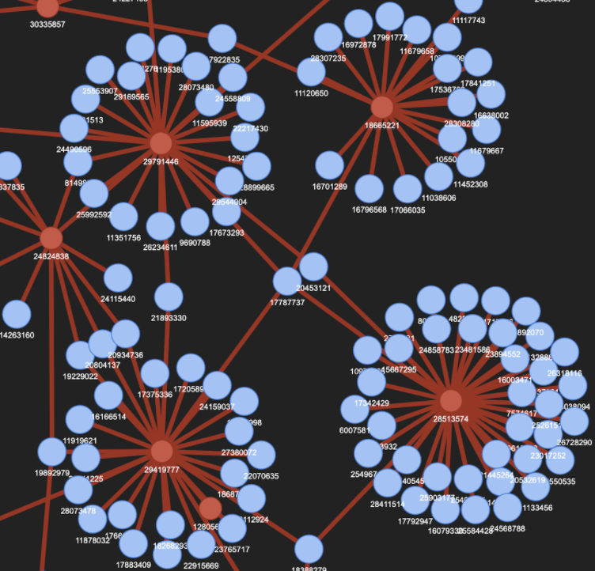
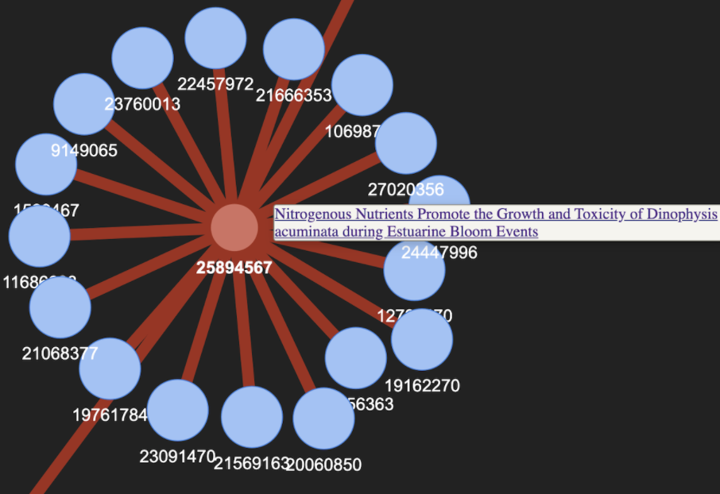
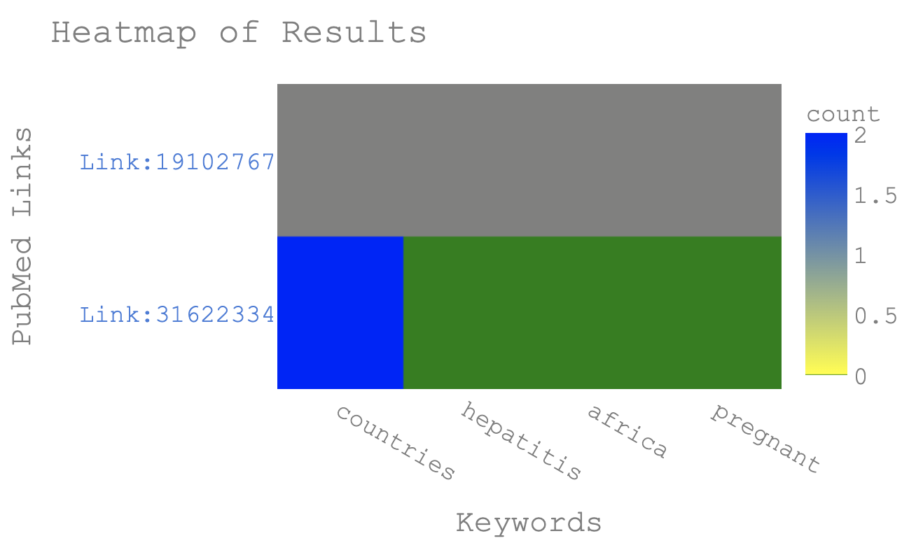
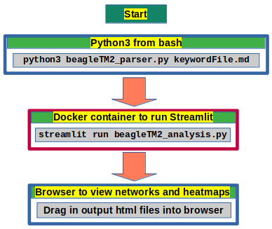

##### BeagleTM: PubMed Interactive Knowledge Discovery
##### Date: 29 December 2021
##### Oliver Bonham-Carter, [Allegheny College](https://allegheny.edu/)
##### email: obonhamcarter@allegheny.edu

---


[](https://opensource.org/licenses/MIT)
[](https://spacy.io)
[](https://www.streamlit.io/)
[](https://travis-ci.com/developmentAC/beagleTM.svg?branch=master&status=passed)
[](https://travis-ci.com/github/developmentAC/beagletm_devi)
[](https://codecov.io/gh/myResearchTM/beagleTM)
[](https://blacklivesmatter.com/)

GitHub link: https://github.com/developmentAC/beagleTM

## Table of contents

* [Overview](#overview)
* + [Relationship Networks](#relationship-networks)
* [Command Summary](#command-summary)
* + [Docker Desktop](#docker-desktop)
* [Keywords](#keywords)
* [Setting up the corpus](#setting-up-the-corpus)
* [Running BeagleTM](#running-beagleTM)
* + [Run a parser job](#run-a-parser-job)
* + [Run an analysis job](#run-an-analysis-job)
* [Analysis methods](#analysis-methods)
* + [Run a Parsing Job](#run-a-parsing-job)
* [Analysis](#analysis)
* + [What are we doing with this data?](#What-are-we-doing-with-this-data)
* [Extra Notes](#extra-notes)
* [Citing](#citing)
* [A Work in Progress](#a-work-in-progress)


## Overview

BeagleTM is an interactive text mining tool to facilitate discovery of knowledge in [PubMed](https://pubmed.ncbi.nlm.nih.gov/) peer-reviewed articles. In addition to locating the articles according to their abstracts, BeagleTM also connects articles based by the common language between them. The results of BeagleTM are connected networks which could be used as a starting place for a literature review at the beginning of the project.


BeagleTM Named after my puppy Beagle, Flint, who spends all his time rooting all around with his nose to the ground. By an exhaustive study of seemingly all words of the abstracts of articles, connections and discoveroies can be made between references.


BeagleTM has been designed to discover knowledge in PubMed articles and supporting references for the convenient creation of sophisticated literature reviews. The data for BeagleTM comes from curated article data made available from PubMed's [ftp site at ftp://ftp.ncbi.nlm.nih.gov/pub/pmc/oa_bulk/](ftp://ftp.ncbi.nlm.nih.gov/pub/pmc/oa_bulk/).

Text mining article information with BeagleTM involves two steps: _Parsing_ and _Analyzing_. During _parsing_, abstracts from the corpus documents are checked for their keyword content. Results are saved in an output document which undergo _analysis_ to find relationship networks (i.e., the interconnections between the knowledge of articles according to keyword content). These inter-relationships concern common themes of studies, articles of similar keywords, articles which are connected by common references and other types of bridges that serve to combine the intricate facts of knowledge areas.


#### Relationship Networks

A relationship network displays the connected information as obtained with keywords. The network includes the main articles for which the keywords are relevant, and their supporting references in which the keywords are likely to be relevant. Networks are written in `html` files and are to be opened in a browser, shown in Figure 1, each node of a network is labeled with PubMed’s PMID identifier number that serves to hyperlink nodes to articles at PubMed.

There are two types of nodes available in the networks: red and blue, for main and supporting reference articles, respectively. We note that the keywords are present in abstracts of main articles (red nodes), whereas they are not necessarily a part of supporting documents (blue nodes).


Figure 1: The articles relating to keywords create a body of knowledge. Main articles (red nodes, found by keyword content) are connected to their reference (blue nodes) articles. In networks, we are able to visualize which blue nodes serve as bridges for more than one red node to suggest that these references may be important bridges between works.


Shown in Figure 2, a mouse-over action of each node shows some metadata behind the nodes. In the case of red nodes (main articles), a title may be displayed which also serves as a link to the article at PubMed. In the case of blue nodes (reference articles), only a link to the article at PubMed may be obtained; the title information was not available during the text-mining process of the articles.



Figure 2: A screenshot of the red (main articles) and blue (supporting references). A mouse-over gives a title and link for red nodes and only a link for blue nodes.


Heatmaps are also available in which articles may be discovered according to their counts of supplied keywords, as shown in Figure 3.


Figure 3: Heatmaps provide a new way of deciding which articles are most relevant according to the numbers of keywords in their abstracts. Each colour represents a different count of keywords found in abstracts and a mouse-over will show that count for the keyword's column.


## Command Summary

Below are commands to run BeagleTM. Due to all the libraries that are required by the software, a Docker container is used. The below listing of commands initiated the Docker container and then launches the tool inside the container.


+ Working directory
 + `beagleTM/src/`


+ Build and run the Docker container
 + `sh dockerRunScripts/build_macOS.sh`
 + `sh dockerRunScripts/run_macOS.sh`


+ Run BeagleTM to view splash screen
 + `./beagleTM2_parser.py`


+ Run BeagleTM's Parser with a keyword
 + `./beagleTM2_parser.py keywords_sample_i.md`


+ Run the browser using Streamlit to view and make plots of results.
 + `streamlit run beagleTM2_browser.py`

+ End the container with `CONTROL-C` or similar, depending on your OS.


### Docker Desktop

You must first install a Docker Desktop  (https://www.docker.com/) container to run the tool. While the literature parsing stage may be run outside of a container, it is still recommended that a container be used to run all code for BeagleTM. In Figure 4, we note how a container is used in conjunction with Streamlit (https://www.streamlit.io/). Note, Streamlit is automatically installed when the container is built.


Figure 4: You are not required to use the parser (`./beagleTM2_parser.py`) in a container but doing may reduce the complexity of installing relevant libraries. The browser code ought to be run in the container.

#### OS-specific scripts to build and run containers
The following bash scripts simplify building the container.

| OS  | Building  | Running  |
|---|---|---|
| MacOS  		|  `./build_macOS.sh` |  `./run_macOS.sh` |
| Linux   	|  `./build_linux.sh` | `./run_linux.sh`  |
| Windows 	|  `build_win.bat` 		|  `run_win.bat` |


These files may be found in the directory, `dockerRunScripts/` and the builder require a copy of `Dockerfile` to run. The `Dockerfile` is found in the main directory and so it is recommended that the user stay in the main and enter the command, ` sh ./dockerRunScripts/build_macOS.sh` or similar. Building your container outside of `dockerRunScripts/` allows you to access the other directories when inside the container.


Please note that you may be required to enter your password twice, depending on your machine. The first time you enter your password will be to build and initialize the Docker container. The second time you enter your password will be to change ownership of your output files from `root` to `$USER` once you exit the container.


### Keywords

BeagleTM is a supervised text mining system necessitating keywords. to create a listing of keywords, the file _must_ have the below form and syntax.

A keyword file (written in [Markdown](https://www.markdownguide.org/cheat-sheet/)) must have the first line, `#### keywords`, which is followed by a line-by-line listing of searchable words in the PubMed abstracts.


```
#### keywords
keyword_1
keyword_n
```

There is no limit to the number of keywords although it should be mentioned here that the resulting output file may become too large to be analyzed in feasible time. It is, therefore,  advised that the keywords lists be no longer than necessary, and be very specific to the type of literature review being created.

## Setting up the Corpus

NCBI offers bulk downloads of literature in two types of  packages: _commercial_ and _non-commercial_. Please see https://ftp.ncbi.nlm.nih.gov/pub/pmc/readme.txt for more information.

BeagleTM has been designed to work with the xml files which may be found at the below online repositories.

+ _Commercially_ available
 + https://ftp.ncbi.nlm.nih.gov/pub/pmc/oa_bulk/oa_comm/xml/

+ _Non-Commercially_ availably
 + https://ftp.ncbi.nlm.nih.gov/pub/pmc/oa_bulk/oa_noncomm/xml/


Bash scripts may be employed to automate the download (using `wget ftpLink`) and un-tarring (using `tar -zxvf filename.tar.gx`) tools, however please note that the archive filenames appear to change each month and so the scripts will also have to be updated.


### Flow of setting up corpus

+ Make a directory to store your downloaded files. Ex: `myDownloadedCorpusFiles/`

+ Choose the files you need from NCBI and use the following type of command to download the file to your local machine.

```
wget https://ftp.ncbi.nlm.nih.gov/pub/pmc/oa_bulk/oa_noncomm/xml/oa_noncomm_xml.incr.2021-12-27.tar.gz
```
You could also use your browser to download the files.

+ Once all files are stored in the same directory, you will need to _untar_ (uncompress) the files. Make another directory called `corpus/` inside `myDownloadedCorpusFiles/` and cd into `myDownloadedCorpusFiles/corpus/` to begin _untarring_ your files using the below command. Note, this command functions to `untar` all `tar.gz` files in the proceeding directory which could take some time to do.

```
tar -zxvf ../*.tar.gz`
```


+ Manually move the `myDownloadedCorpusFiles/corpus/` directory into `src/` of your BeagleTM project so that the tool's Python software will be able to access this directory.


#### Parsing Notes

The path to the `corpus/` directory has been hardcoded in the `beagleTM2_parser_helperCode.py`, however, if using an external hard drive or similar, a path to `corpus/` could be altered by updating the global variable, `CORPUS_DIR` as shown below.


```
# configure your corpus directory here.
#CORPUS_DIR = "corpus/" # local directory # former path and directory
CORPUS_DIR = "myNewCorpusDirectory/" # new path and directory
```


---
## Running BeagleTM

#### Run a parser job

Parsing is done using only the abstracts of the articles. Abstracts are short texts that explain the nature of the paper. Since each word therein is carefully chosen by the authors, the text is likely to give a good synopsis of the article.


+ Run BeagleTM to view splash screen
 + `./beagleTM2_parser.py`


+ Run BeagleTM's Parser with a keyword
 + `./beagleTM2_parser.py keywords_sample_i.md`


The output files of this operation will be placed into the `data/` directory.

#### Run an analysis job

To check the results, we will use Streamlit inside a Docker  container


+ Run the browser using Streamlit to view and make plots of results.
 + `streamlit run beagleTM2_browser.py`


When running your container, to access Streamlit, you will need to use your browser using the link, `http://127.0.0.1:8501/`. Once Streamlit is running the analysis program, then direct the program to the `data/` directory to load the output files from the parsing operation above.


#### Analysis methods

When you launch the browser-side of the tool in Streamlit, use the panel on the left to choose the `.csv` file from `data/`.


#### What are we doing with this data?

Below we discuss some of the plots that are created by an analysis. All plots will be automatically saved to the `/tmp` directory. This project was created in Linux but if you are using Windows, then a search for the files (see the browser tabs) will show you where they are being saved. In addition,  if the Manifests (collections of keywords for the current plot) are saved by clicking on the _Save a Manifest_ button, then these files will also be saved in the same directory as the plots.

There are several options to choose from for the analysis.
 - **Show_data** : Displays a data table of the current data.


 - **Articles connected by pmids** : We use networks (from the `pyvis` library) to get a view of all articles in the dataset along with their connections to their supporting reference articles. Here we note that the red and blue nodes indicate main and reference articles, respectively. From this view, we can see which reference articles are being listed by more than one article.

 - **Articles having ANY of the selected keywords** : By selecting keywords in the selection field, we are able to see which articles surface to have _at least one_ of the keywords in their abstracts. All abstracts for which any one these keywords is presents may suggest a loose type of inter-relationship.

 - **Articles having ALL of the selected keywords** : By selecting keywords in the selection field, we are able to see which articles surface to have _ALL_ of the keywords in their abstracts, simultaneously. These papers are rare and are to be considered *strong* papers since they contain all requested keywords. In addition, these papers may serve to connect the keywords in some way using published research.

  We note that abstracts are carefully worded short texts in which each word seemingly plays a central role in the context of the article. To discover an abstract for which all supplied words are present may suggest that the keywords share a _guilt by association_ and we may perhaps conclude that a strong relationship exists. Please also note that as lists of keywords extend, it is less likely to find them all in a single abstract.


 - **Heatmaps of keyword saturation** :
 Viewing articles as heatmaps allows us to determine which articles have  most of the supplied keywords. On the left, links to the PubMed articles may be used to access articles which may be more important to a particular search for knowledge. Please note that you may need to zoom-in (see controls at the upper right in heatmap plot) to be able to find the exact article link for the line in the heatmap. This would be necessary in the case of many articles in the dataset in which  keywords have been found.

---

## Citing this work

If you would like to cite this work, then place use the following reference.
The current interactive BeagleTM software is a derivative of this former work.

``` bash
Bonham-Carter, Oliver. "BeagleTM: An Adaptable Text Mining Method for
 Relationship Discovery in Literature."
 Future of Information and Communication Conference.
 Springer, Cham, 2020.
```

The BibTex code is provided below.

``` bash
@inproceedings{bonham2020beagletm,
 title={BeagleTM: An Adaptable Text Mining Method for Relationship Discovery in Literature},
 author={Bonham-Carter, Oliver},
 booktitle={Future of Information and Communication Conference},
 pages={237--256},
 year={2020},
 organization={Springer}
}
```

## A work in progress

Check back often to see the evolution of the project!! BeagleTM is a work-in-progress. Updates to the methods and tests for the code will come soon and I will continue to update the repository with updates. If you would like to contribute to this project, __then please do!__ For instance, if you see some low-hanging fruit or task that you could easily complete, that could add value to the project, then I would love to have your insight.

Otherwise, please create an Issue for bugs or errors. Since I am a teaching faculty member at Allegheny College, I may not have all the time necessary to quickly fix the bugs and so I would be very happy to have any help that I can get from the OpenSource community for any technological insight. Much thanks in advance. I hope that this project helps you find the knowledge from PubMed that you require for your project. :-)
